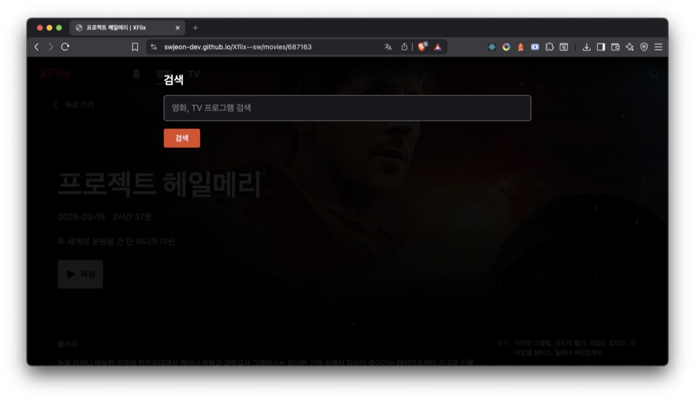
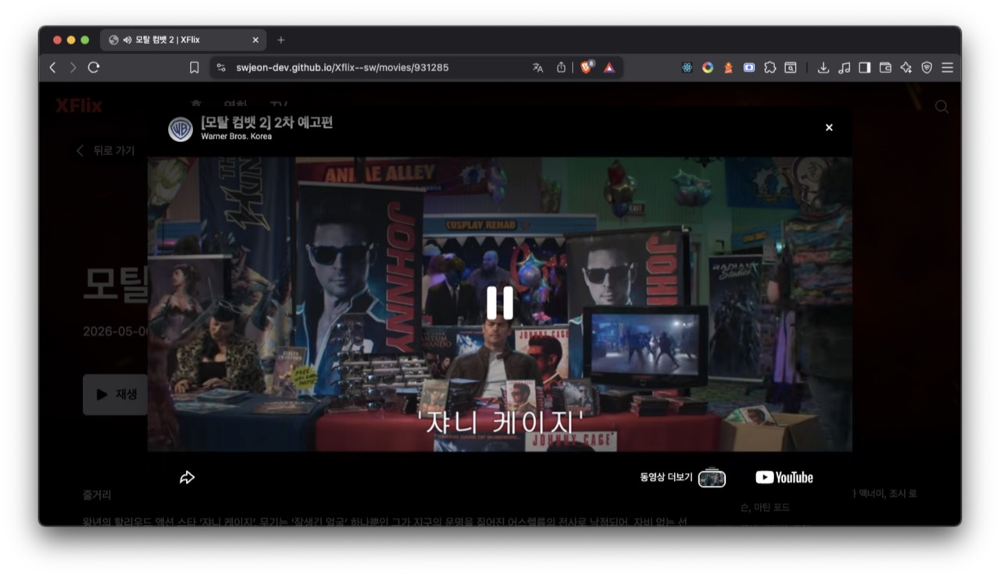

# 🎬 Xflix

[](https://github.com/swjeon-dev/Xflix--sw/actions/workflows/deploy.yml)
[](https://swjeon-dev.github.io/Xflix--sw/)

TMDB API 기반 영화·TV 탐색 서비스입니다.  
단순 조회를 넘어서, **검색 / 무한 스크롤 / 모달 / 라우팅 / 스크롤 잠금** 같은 프론트엔드 핵심 기능을 라이브러리에 크게 의존하지 않고 직접 구현한 포트폴리오 프로젝트입니다.

## 프로젝트 한 줄 소개

**React 기본기와 브라우저 API를 다시 익히기 위해, 자주 쓰는 편의 라이브러리를 최소화하고 기능을 직접 설계한 영화 탐색 서비스**입니다.

## 왜 이 프로젝트를 만들었는가

이 프로젝트의 목적은 "라이브러리를 안 쓰는 것" 자체가 아니라,  
직접 구현을 통해 다음을 분명하게 이해하는 것이었습니다.

- `state`, `effect`, `cleanup`, `ref`가 실제 화면 흐름에서 어떻게 동작하는지
- `IntersectionObserver`, `URLSearchParams`, `matchMedia` 같은 브라우저 API를 React 코드와 어떻게 연결하는지
- 그리고 반대로, **왜 React Query 같은 라이브러리가 실무에서 필요한지도 체감하는 것**

즉, 약간의 불편함을 감수하더라도 **기본기 회복과 설계 감각을 키우는 것**을 목표로 했습니다.

## Screenshots

아래 섹션에는 정적 화면 캡처와 클릭 가능한 시연 영상 썸네일이 함께 포함되어 있습니다.

### Home (시연 영상)

영화 / TV 추천 섹션을 홈 화면에서 탐색할 수 있습니다.

[](https://youtu.be/n_8vgYt2KdM)

Header 검색 버튼을 통해 검색 모달을 열고 검색어를 입력할 수 있습니다.


### Search Results (시연 영상)

검색 결과 페이지에서 영화 / TV 탭을 나누어 확인하고, 스크롤에 따라 다음 페이지를 불러옵니다.

[](https://youtu.be/RFjKMFadLKE)

### Detail Page (시연 영상)

상세 페이지에서 콘텐츠 정보와 추천 콘텐츠를 함께 탐색할 수 있습니다.

[](https://youtu.be/9oWzFkbKLP0)

[](https://youtu.be/10UZRu43_Fc)

### Trailer / Modal UX

예고편 모달, ESC 종료, body scroll lock 등 모달 UX를 직접 구성했습니다.


### Mobile UX (시연 영상)

모바일 환경에서도 메뉴 및 모달 흐름이 자연스럽게 동작하도록 구성했습니다.

[](https://youtu.be/iF6piaEjP5o)

## 주요 기능

- 홈에서 영화 / TV 콘텐츠 탐색
- 영화 / TV 목록 페이지
- 영화 / TV 상세 페이지
- 예고편 모달 재생
- 검색 모달 및 `/search?query=` 기반 검색 결과 페이지
- 영화 / TV 탭 분리 검색
- `IntersectionObserver` 기반 무한 스크롤
- 모바일 메뉴 모달 및 body scroll lock

## 직접 구현한 포인트

### 1. 커스텀 훅 기반 데이터 패칭

- `useGetContents`
- `useGetMovie`
- `useGetTVs`
- `useGetTmdbVideos`
- `useSearch`

각 훅이 `loading / error / data / refetch`를 직접 관리하도록 구성했습니다.

### 2. 라이브러리 없이 구현한 무한 스크롤

`shared/model/infinite-scroll.ts`에서 `IntersectionObserver`를 직접 사용해:

- 홈 캐러셀의 가로 스크롤
- 목록 페이지의 세로 스크롤
- 검색 결과 페이지의 추가 로딩

을 공통 훅으로 처리했습니다.

### 3. 검색 라우팅과 페이지 보호

- 검색어 입력 시 `/search?query=...`로 이동
- `searchListLoader`에서 query가 없으면 홈으로 redirect
- 검색 결과는 `movie` / `tv` 탭으로 분리

### 4. 모달 UX 직접 구성

- `Modal` 포털 구현
- ESC로 닫기
- `useBodyScrollLock`으로 body 스크롤 잠금 처리

## 기술 스택

- React
- TypeScript
- Vite
- React Router 7
- React Helmet Async
- Tailwind CSS
- GitHub Actions
- ESLint

## 디렉터리 구조

```text
src/
├── app/
├── pages/
├── entities/
├── features/
│   ├── movies/
│   ├── search/
│   └── tv/
├── widget/
└── shared/
```

FSD를 가볍게 적용한 구조로, 페이지 조립 / 기능 / 공통 모듈의 책임을 분리했습니다.

## 실행 방법

```bash
npm install
npm run dev
```

환경 변수:

```bash
VITE_TMDB_ACCESS_TOKEN=your_tmdb_access_token
```

## 회고

직접 구현은 분명 불편했습니다.  
하지만 그 과정은 **React 기본기와 브라우저 API를 다시 익히는 데 큰 도움이 되었고**, 캐싱, 중복 요청 제어, 스크롤 잠금, 검색 상태 동기화 같은 문제를 손으로 다뤄보게 해줬습니다.  
그 결과 **기본기와 함께 라이브러리의 필요성도 더 정확히 이해**할 수 있었습니다.
