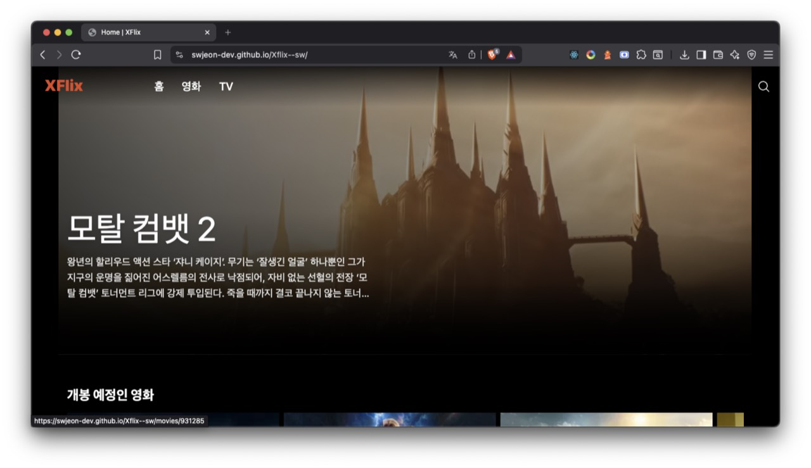
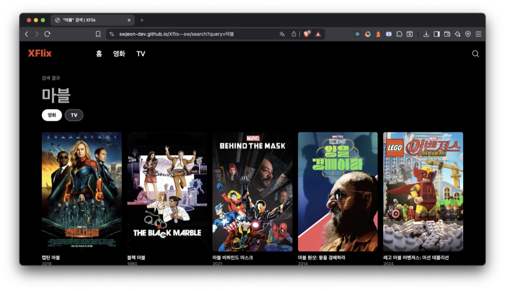

# Xflix

[](https://swjeon-dev.github.io/Xflix--sw/) [](https://www.figma.com/make/6gAd7XAT3ErQOj8xVDt8Cq/Movie-Detail-Page-Design?p=f&t=zVHKCNqmHkqM0ES3-0)

TMDB API 기반 영화·TV 탐색의 **Vite + TypeScript SPA**입니다.

## 화면






## Work

- TMDB 요청을 `shared/api`에 모으고, 목록·상세·검색은 커스텀 훅에서 직접 다룹니다.
- `IntersectionObserver`로 홈 캐러셀(가로)과 목록·검색(세로) 무한 스크롤을 공통 훅으로 처리합니다.
- 헤더 검색 모달 → `/search?query=` , 영화 / TV 탭 분리.
- Portal 모달, body scroll lock, ESC 종료.

## 코드 구조

**Feature-Sliced Design**을 규모에 맞게 적용했습니다.

```text
src/
  app/          AppRouter, providers, routes
  pages/        Home, Movie, TV, Search, Detail
  widgets/      header, home, carousel, genre-section, movie-detail, tv-detail
  features/     search, trailer, episodes
  entities/     movie, tv, genre, media
  shared/       api, ui, config
```

```text
app → pages → widgets → features → entities → shared
```

## 스택

React · TypeScript · Vite · React Router · Tailwind CSS · TMDB API

## 실행

```bash
npm install
npm run dev
```
